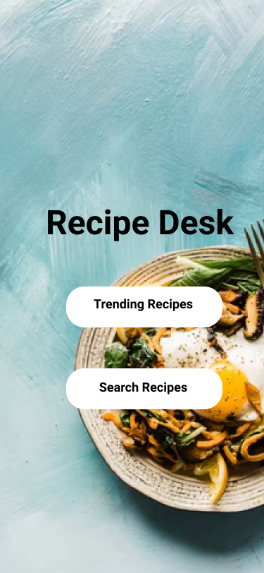
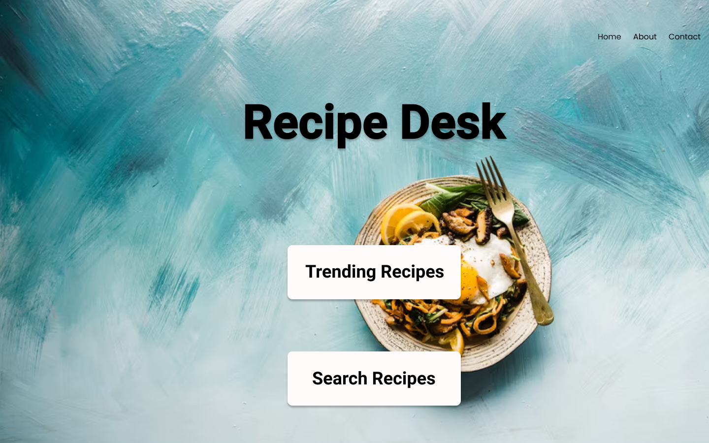
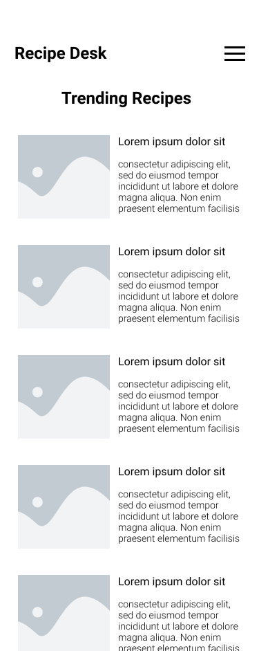
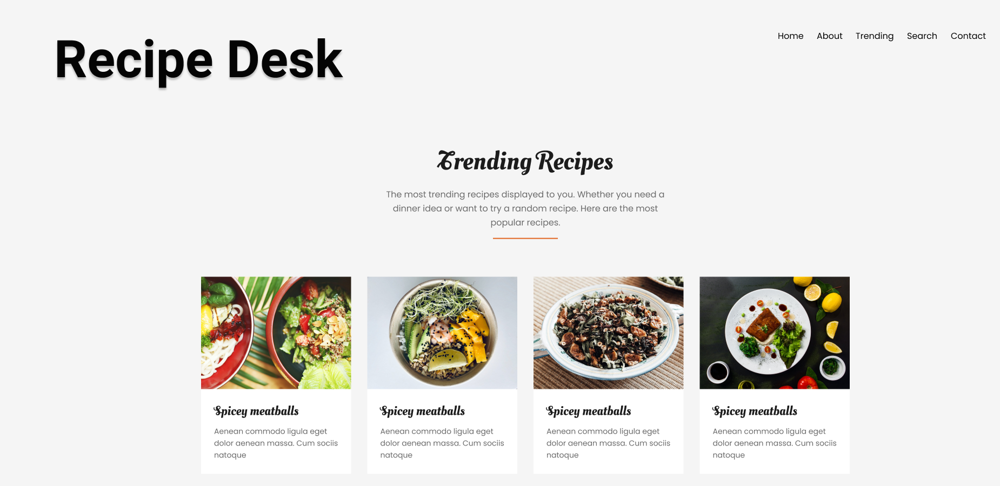
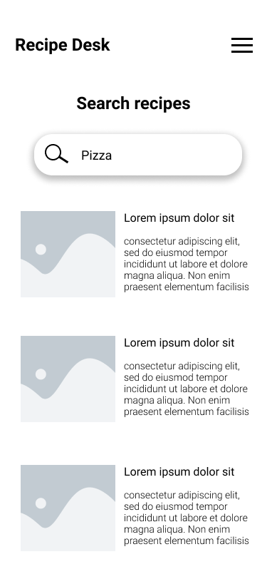
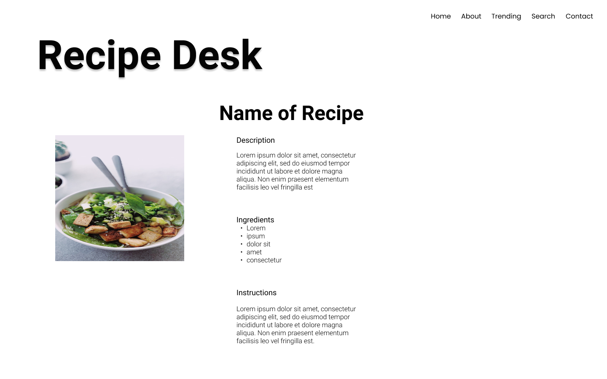

# 🍽️ Recipe Desk 🍽️

Recipe desk is a responsive website that allows the user to find popular recipes or search recipes. Whichever they choose, they will be lead to a more detailed page with a summary of the recipe, ingredients, and instructions on how to prepare the meal. Below the details, they will find a button to find similar recipes. Here this will lead to them to a list of similar recipes to the one that they were just on.

## Wireframe

App concept on [Figma](https://www.figma.com/file/5BN6cHtH2w2gaxURvWE3z8/Phase-1-Project?node-id=0%3A1).

 | Mobile                                             | Desktop                                              |
 |----------------------------------------------------|------------------------------------------------------|
 |  |  |  
 | | |
 |     |     |

## API

#### For this project we used the API [Spoonacular](https://spoonacular.com/food-api).

"We are more than just a recipe API. We provide solutions to make any food-related vision a reality."

## Features

- **Trending Recipes page**: Here the user can see the most popular recipes in the database.
- **Search Recipes page**: Here the user can search up a recipe or general food and receive relevant recipes.
- **Details page**: Every recipe the user clicks they will be redirected to a detailed page including summary on the recipe, ingredients, instructions and a similar recipe button.
- **Similar recipe page**: The user will get a list of similar recipes to the one they recently viewed.
- **About Us Page**: Users will find info about the website here, about the collaborators, and the api.

## Interface

- Grid view for viewing recipe cards
- Responsive design
- Search Bar

## Collaborators

- [Jasmin Hernandez](https://github.com/jasmincher)
- [Braun Payne](https://github.com/qu3stion)
